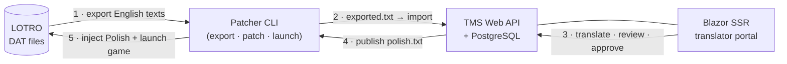

# LOTRO Polish Translation Platform

> An end-to-end platform that lets a community translate **The Lord of the Rings Online** into
> Polish: a web-based **Translation Management System** for the editorial workflow, plus a
> game-patching **CLI** that injects the approved translation back into the game.


**🔗 Live:** https://lotro-translator.pl &nbsp;·&nbsp; **Staging:** https://staging.lotro-translator.pl

---

## Overview

The Lord of the Rings Online has no official Polish localization. Historically, the only way to play
in Polish was to hand-edit the game's **binary `DAT` files** — fragile, solitary work that is easy to
corrupt and breaks on every game patch. This project turns that into a proper, collaborative pipeline.

It is built as **two cooperating products** that share a single versioned file contract — not code:

1. **Translation Management System (TMS)** — a web platform where translators import the game's
   English texts, translate them with a review/approval workflow, and the system publishes a
   ready-to-apply translation file. *(Sections below, top.)*
2. **Patcher** — a command-line tool that exports the English texts from the game, downloads the
   approved Polish file from the TMS, injects it back into the `DAT`, and launches the game.
   *(Section at the bottom.)*

> **Under the hood:** a from-scratch, production-deployed **.NET 10** system built on Domain-Driven
> Design, Vertical Slice Architecture, CQRS, a Result-monad error model, a self-hosted OAuth2/OIDC
> server, Blazor static SSR, reverse-engineered binary-format handling, and a containerized
> CI/CD pipeline that deploys itself. Architecture notes are in each section and in
> [`docs/`](docs/).

### How it works — the core loop



When the game updates, the new English export is re-imported: texts whose English source changed are
automatically **invalidated** (flagged *needs review*) and **excluded** from the published file until
a translator re-approves them — so the game never shows a stale Polish line for changed content.

---

## Translation Management System (TMS)

The web application at the heart of the project — where the human translation work happens.

### What a translator can do

- **Import** a version-bound game export (`exported.txt`). The import runs a **diff** against the
  existing catalog and reports exactly what changed: *added / English-changed / invalidated /
  removed / unchanged*.
- **Browse, search and filter** the whole catalog — by English or Polish text, and by status
  (*untranslated · draft · approved · needs review*) — with pagination.
- **Translate** in a **side-by-side editor**: read-only English on the left, the Polish translation
  on the right, with live validation of the `<--DO_NOT_TOUCH!-->` argument placeholders (so dynamic
  values like player names or item counts are never broken).
- **Review & approve** (single rows or a bulk selection): approving a translation publishes it into
  the distributed file; changed English re-opens a row for review.
- **Track game versions**: the catalog is bound to a LOTRO version; admins register versions
  manually *(automatic detection from the official forum is on the roadmap)*.
- **Export / download** the approved `polish.txt` in one click — the same artifact the Patcher CLI
  pulls automatically (served with `ETag`/`304` caching).
- See a **progress dashboard**, behind **authentication with roles** (translator / admin); a public
  landing-page snapshot exposes the aggregate counters anonymously.

### Architecture & engineering

| Area | Choice |
|---|---|
| **Language / runtime** | .NET 10, C# 14, ASP.NET Core Minimal APIs |
| **Application architecture** | **Vertical Slice Architecture** — one feature = endpoint + command/query + handler; **no MediatR** (a small in-house messaging abstraction instead — [ADR-0001](docs/adr)) |
| **Domain** | **DDD** aggregates + value objects (no primitive obsession); business failures are **values, not exceptions** (a `Result`/`Error` monad) |
| **Persistence** | **PostgreSQL** + EF Core (Fluent API only); **CQRS** read/write split — queries read POCO read-models, commands mutate aggregates via repositories + unit of work |
| **Authentication** | self-hosted **OpenIddict** authorization server (OAuth2 / OIDC, authorization-code + PKCE, refresh tokens, JWKS); the API is a JWT-bearer resource server; translators are provisioned lazily on first authenticated request |
| **Frontend** | **Blazor static SSR** (no WebAssembly, no SignalR circuit) as an **OIDC relying party** with silent token refresh; a **HATEOAS**-driven UI where the server's link relations decide which actions a user sees |
| **Bounded contexts** | TMS and Patcher integrate **only** through the versioned `\|\|` translation-file contract — round-trip-tested against golden fixtures on both sides, so the format can never drift unnoticed |
| **Observability & ops** | Serilog + OpenTelemetry; **Docker Compose** behind a **Caddy** reverse proxy (automatic Let's Encrypt TLS); **GitHub Actions** CI/CD that ships signed, provenance-attested images to a **Hetzner VPS** over ssh, with a gated **staging → production** promotion. The stack ran on **Terraform**-provisioned **Azure Container Apps** until 2026-07 ([ADR-0034](docs/adr/0034-hetzner-vps-instead-of-azure-container-apps.md) records why it moved) |
| **Quality gates** | zero-warning builds (`TreatWarningsAsErrors`), ADR-driven decisions, spec-first features, secret scanning (pre-commit gitleaks + CI + GitGuardian), and a layered test suite (unit · integration on real PostgreSQL · Playwright browser E2E) |

### Repository layout

```
src/
  TranslationSystem/   TMS — Primitives · Domain · ReadModels · Persistence · Contracts · API
  AuthSystem/          self-hosted OpenIddict + ASP.NET Identity authorization server
  Frontend/            Blazor static-SSR translator portal (OIDC relying party)
  SharedKernel/        Result/Maybe monads, building blocks, in-house messaging abstraction
  Patcher/             game-side CLI — Cli · Application · Domain · Infrastructure · Primitives
  Utilities/           small shared helpers
tests/                 Unit · Integration (real PostgreSQL) · E2E (CLI + Playwright browser)
docs/                  API · domain · invariants · ADRs · specs · deployment runbook · knowledge base
```

### Run the TMS locally (dev)

The dev loop is **infrastructure in Docker + the three apps on the host** (fast hot-reload, no image
rebuilds):

```bash
scripts/up.sh                     # boots Postgres + migrator + Mailpit + Aspire dashboard
                                  #   (Windows: scripts/up.ps1)
dotnet dev-certs https --trust    # one-time, so the host serves trusted HTTPS

# then start the three apps (Rider compound ".run/TMS dev (all hosts)", or individually):
dotnet run --project src/AuthSystem/LotroKoniecDev.AuthSystem.API                # https://localhost:5003
dotnet run --project src/TranslationSystem/LotroKoniecDev.TranslationSystem.API  # https://localhost:5002
dotnet run --project src/Frontend/LotroKoniecDev.Frontend                        # https://localhost:7017
```

```bash
dotnet build LotroKoniecDev.slnx   # zero-warning build gate
dotnet test                        # everything runnable on this OS
```

Full operator procedure (environment-variable matrix, secret generation, bring-up sequence, DB
migrations) lives in [`docs/deployment/runbook.md`](docs/deployment/runbook.md). A separate
production-parity stack runs via `scripts/up-prod.sh` (`compose.prod.yaml`).

### Documentation

Generated **from the code** (the code is the source of truth):

- [`docs/API.md`](docs/API.md) — full HTTP API reference: every `/api/v1/...` endpoint, authorization
  policies, request/response shapes, status codes + `ProblemDetails`, and the translation-file
  distribution endpoint (`ETag`/`304`).
- [`docs/DOMAIN.md`](docs/DOMAIN.md) — a tour of the domain model: aggregates (`Translation`,
  `GameVersion`, `Translator`), value objects, the update/invalidation lifecycle, and the CQRS split.
- [`docs/INVARIANTS.md`](docs/INVARIANTS.md) — catalogue of enforced business rules, each tagged
  *domain* / *application* with a `file:line` anchor.
- [`docs/auth-tutorial.md`](docs/auth-tutorial.md) — authentication end-to-end (OpenIddict server,
  JWT-bearer resource server, JWKS, lazy translator provisioning, roles & policies).
- [`docs/adr/`](docs/adr) — architecture decision records · [`docs/specs/`](docs/specs) — feature
  specs · [`docs/knowledge-base/`](docs/knowledge-base) — empirical findings about the DAT format and
  how translations survive game updates.

---

## The Patcher (game-side CLI)

A shipped, empirically-proven command-line tool that reads and writes LOTRO's binary `DAT` files. It
is the bridge between the game on a player's machine and the translation file the TMS produces.

### What it does

- **`export`** — pulls every English text out of the game's `DAT` file into `data/exported.txt`
  (the starting point for translation; this is what gets imported into the TMS).
- **`patch`** — injects a Polish translation file back into the `DAT`.
- **`launch`** — hashes the translation file, re-patches **only if it changed**, then starts the
  game. Live testing across real game updates (including a major 47.2 → 48.0 patch) proved that
  translations survive updates, so this is the recommended day-to-day command.
- The CLI can **auto-download** the latest approved file from the TMS (`ETag`-cached), so players
  always get the current translation without manual steps.

It also **auto-discovers** the LOTRO install (default Standing Stone Games path, Steam, the Windows
registry, then a disk scan), runs **pre-flight checks** (game not running, write permissions,
automatic `.backup` of the `DAT`), and maps failures to clear exit codes.

### Requirements & usage

- **Windows** (x86/x64), [.NET 10 Runtime x86](https://dotnet.microsoft.com/download/dotnet/10.0),
  and an installed copy of LOTRO. Writing into `Program Files` needs administrator rights; reading
  does not, so `export` runs without an elevation prompt.

```bash
export.bat                 # game DAT  → data/exported.txt (reads only — no elevation)
patch.bat polish           # translations/polish.txt → game DAT (self-elevates)
lotro.bat polish           # launch: hash-check → patch if changed → start the game
# equivalent: dotnet run --project src/Patcher/LotroKoniecDev.Cli -- launch polish
```

`patch.bat <name>` resolves `translations/<name>.txt`; you can also pass an explicit translation
path and/or an explicit `DAT` path. A `.backup` of the `DAT` is written next to the original — to
revert, copy it back over `client_local_English.dat`.

### Translation file format (the inter-context contract)

Each line is one translation; `#` starts a comment:

```
file_id||gossip_id||translated_text||args_order||args_id||approved
```

```
# Simple text:
620756992||1001||Witaj w Śródziemiu!||NULL||NULL||1

# Text with a dynamic argument (e.g. a player name):
620756992||1002||Witaj, <--DO_NOT_TOUCH!-->!||1||1||1

# Reordered arguments ("Level {0}: {1}" → "Poziom {1}: {0}"):
620756992||1004||Poziom <--DO_NOT_TOUCH!-->: <--DO_NOT_TOUCH!-->||2-1||1-2||1
```

`<--DO_NOT_TOUCH!-->` marks a game-supplied argument and must be kept verbatim; `args_order`
reorders arguments (`NULL` or e.g. `2-1`); `approved` is `1` when the line is approved. Changing this
format requires an ADR and updated golden fixtures in **both** the Patcher and the TMS.

---

## Project status & roadmap

Pre-release, actively developed. The Patcher (**M1**) is shipped and proven on live game updates. The
TMS backend (**M2**, minus the forum watcher — game versions are registered manually for now), the
Blazor frontend (**M3**) and the deployment pipeline (**M6** — Docker Compose on a Hetzner VPS +
Neon Postgres, staging → production promotion) are built and **deployed** (see the live link above).
Next up: a
**game-content catalog** layer over the flat rows (M7 — spec agreed, in the backlog) and a
**desktop player app** (M4, Avalonia) — a GUI over the same patcher engine and TMS download. Backlog and
milestones: GitHub issues (`M{milestone}-{nn}` titles).

## License & disclaimer

The code of this project is licensed under the [MIT License](LICENSE) © Artur Koniec. MIT covers
**our code only** — bundled third-party binaries (notably `datexport.dll`) and any game content are
**not** covered; see [THIRD-PARTY-NOTICES.md](THIRD-PARTY-NOTICES.md) for details.

This is an unofficial, non-commercial fan project, not affiliated with or endorsed by Standing
Stone Games or Middle-earth Enterprises. Standing Stone Games and its marks are trademarks of
**Daybreak Game Company LLC**. *The Lord of the Rings Online* and the characters, items, events and
places therein are trademarks of **Middle-earth Enterprises, LLC**, used under license.
